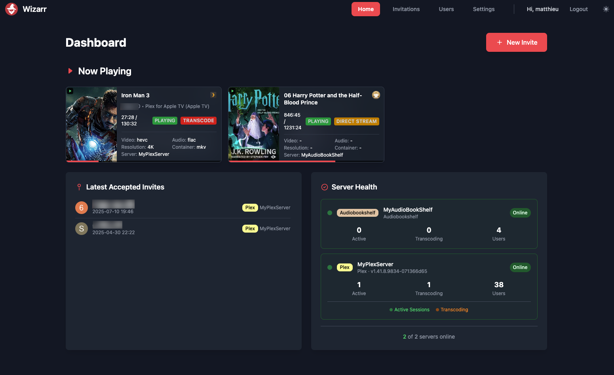
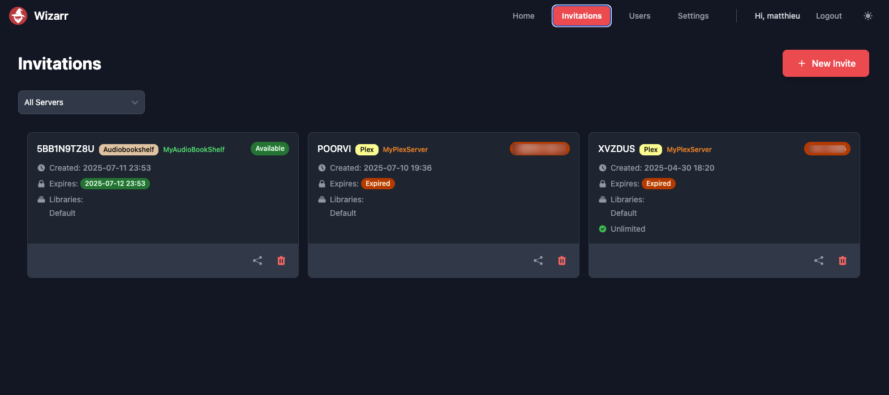
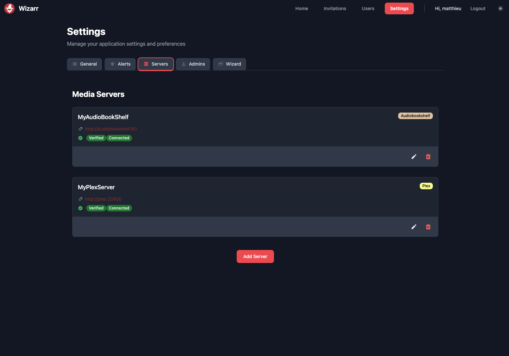
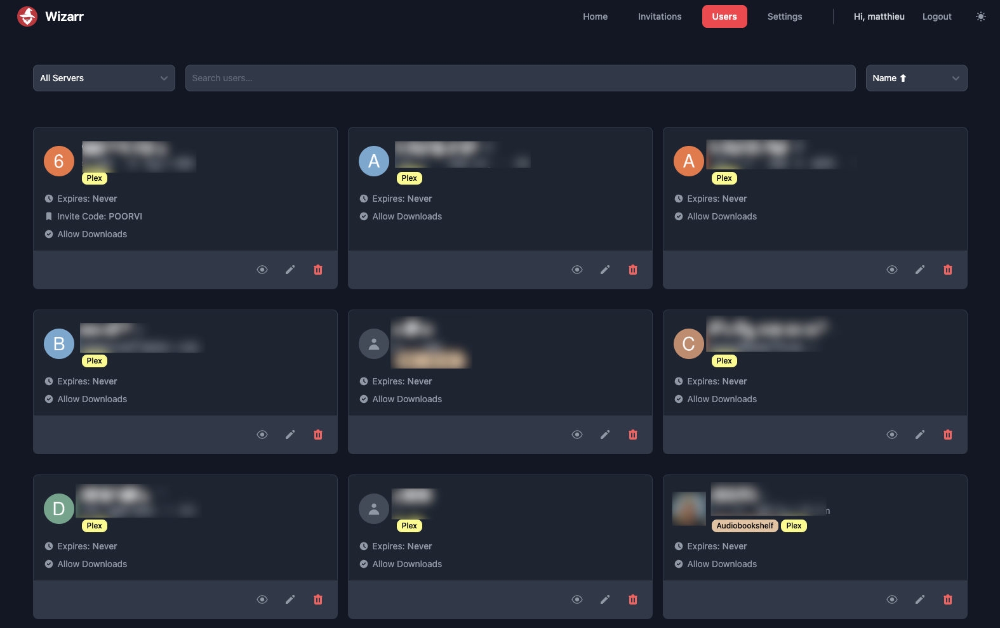
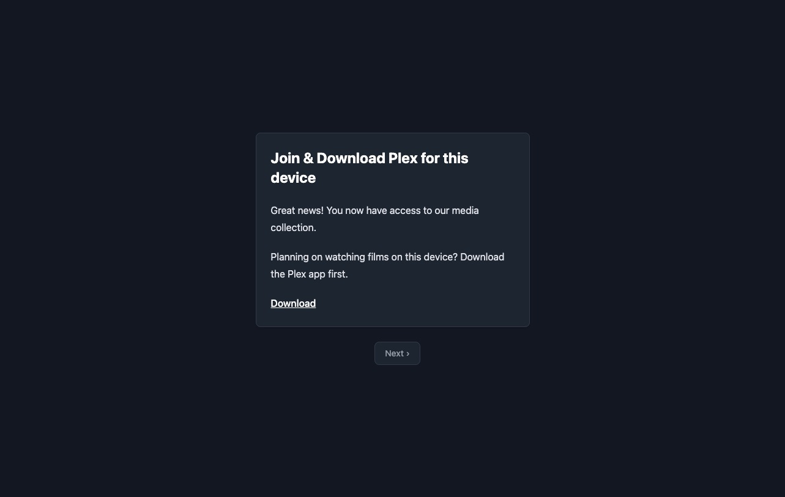
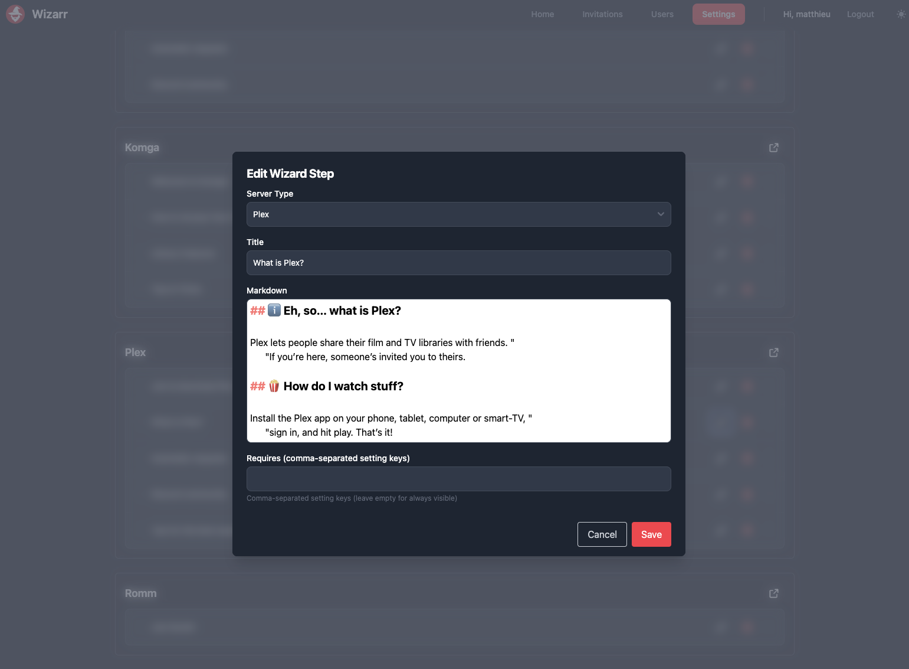

# Wizarr

> 🚀 **Development Relaunched:** We're excited to announce that **Wizarr is back in active development**!

---

Wizarr is an automatic user invitation system for Plex, Jellyfin, and Emby.  
Create a unique invite link and share it with users — they’ll be automatically added to your media server and guided through downloading apps, accessing request systems, and more!

**The problem**: Inviting your Friends/Family to your Plex server Is complicated and tedious. It's also a hard concept for them to get their head around.

**The solution**: Wizarr makes it easy to invite users to your server by simply sending them a link, and guides them through the process of getting set up.

---

## ✨ Major Features

- Automatic invitations for Plex, Jellyfin, Emby, AudiobookShelf, Komga, and Romm
- Secure, user-friendly invitation process
- Plug-and-play SSO support*
- Multi-tiered invitation access
- Time-limited membership options
- Setup guide for media apps (like Plex)
- Request system integration (Overseerr, Ombi, etc.)
- Discord invite support
- Fully customisable with your own HTML snippets

---

## 🚀 Getting Started

Check out our documentation for how to install and run Wizarr:

📚 https://docs.wizarr.dev/getting-started/installation

---

## Sponsorship
Thank you to our sponsor for supporting Wizarr development!

---

## 🌍 Translations

We use Weblate to make Wizarr accessible in many languages.  
Want to help translate? Click below!

---

## ❤️ Thank You

A big thank you to these amazing contributors who’ve helped build and maintain this project:

---

## 📸 Screenshots

