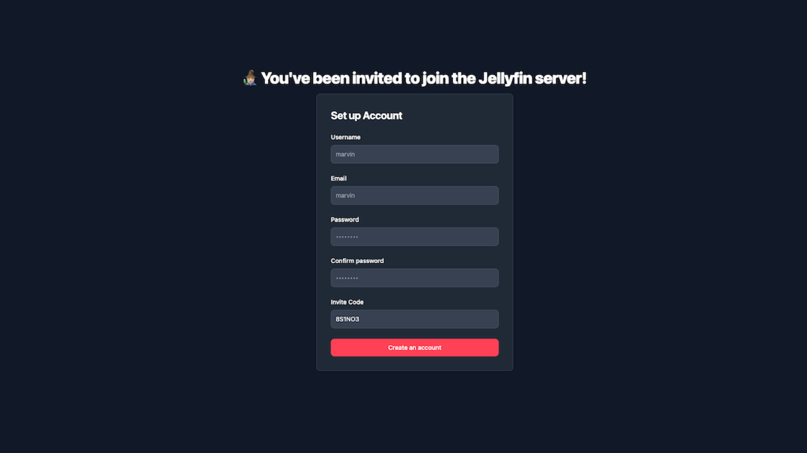
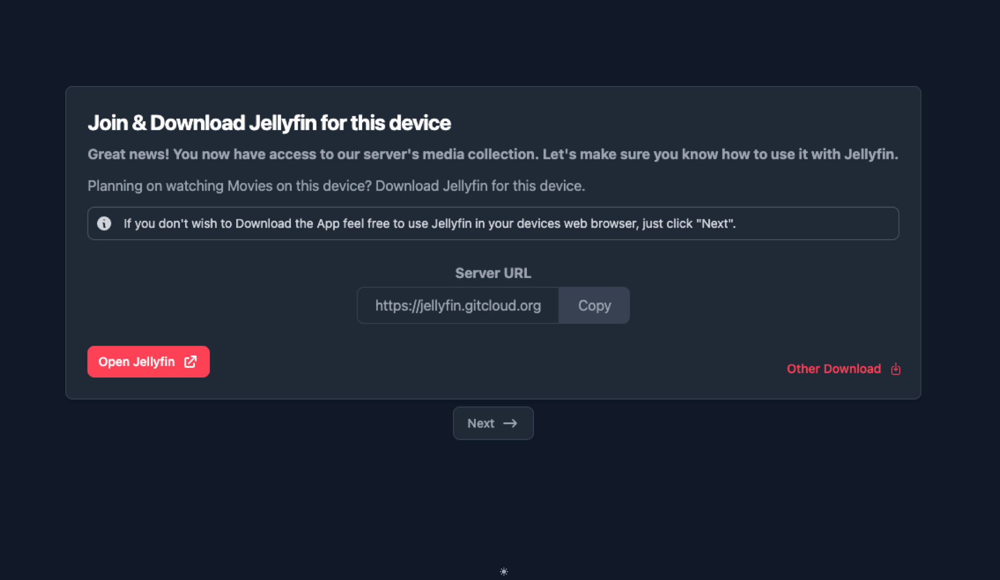
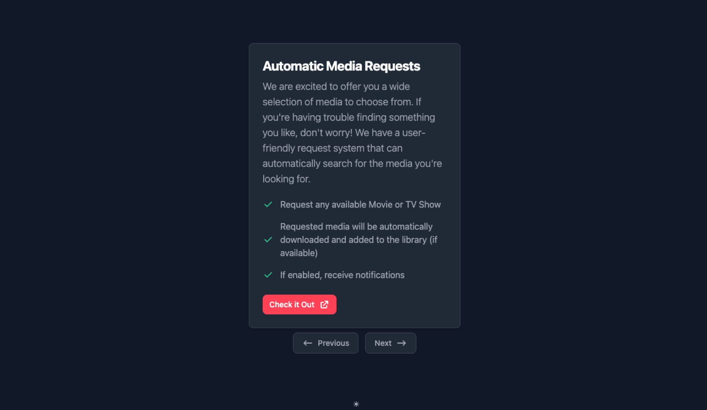
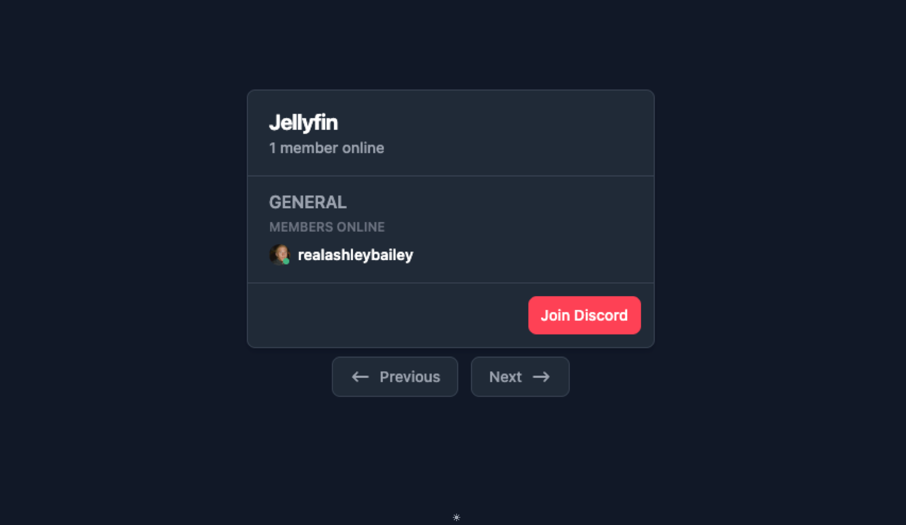
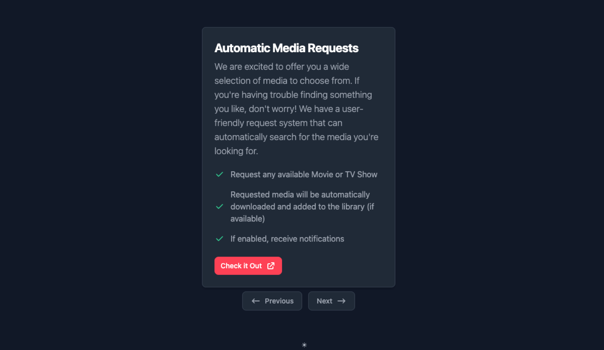
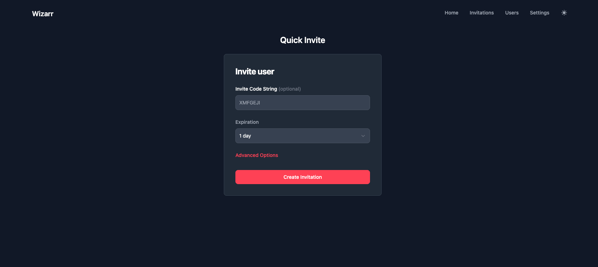
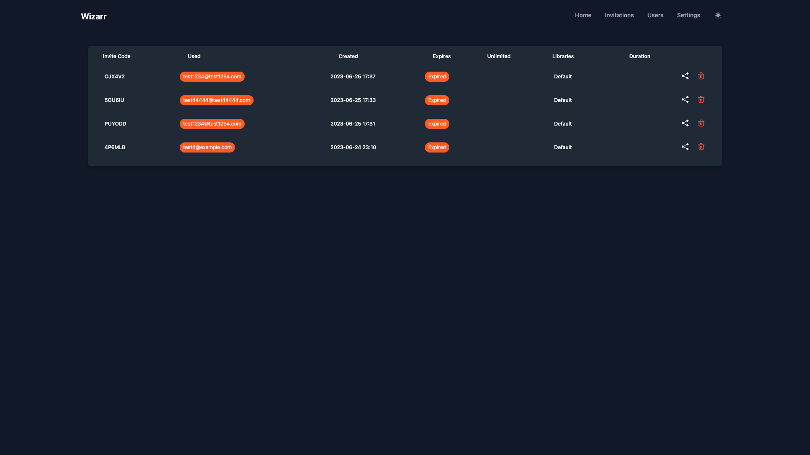
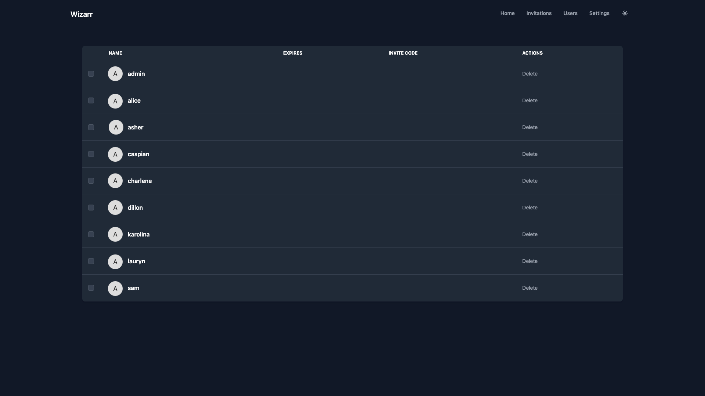
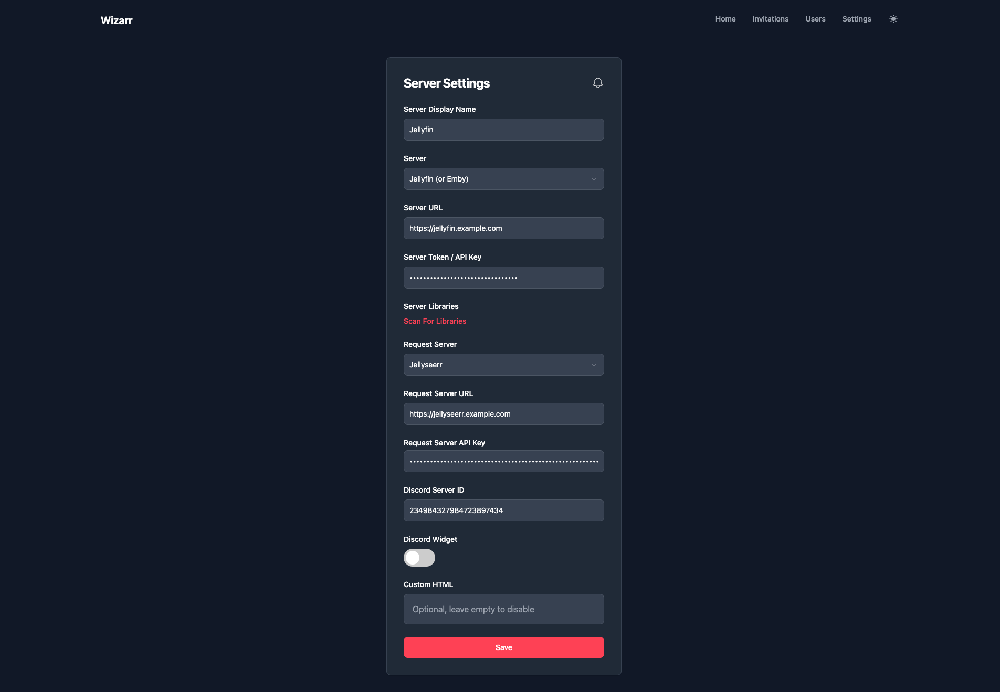

# Wizarr 

Wizarr is a automatic user invitation system for Plex, Jellyfin and Emby. Create a unique link and share it to a user and they will automatically be invited to your Media Server! They will even be guided to download the clients and instructions on how to use your requests software!

## Major Features Include

- Automatic Invitation to your Media Server (Plex, Jellyfin, Emby...)
- Secured invitation environment
- Plug and Play SSO Support*
- Multi-tiered Invitations
- Duration for membership
- Guide user on how to download Plex client
- Requests Integration: Guide users on how to request Movies (Jellyseerr, Overseerr & Ombi)
- Discord Server Integration: Invite users to your Discord Server
- Customizable: Add any Custom HTML 

## Getting Started

Check out our documentation for instructions on how to install and run Wizarr!

https://docs.wizarr.dev/getting-started/installation

## Translations

We use Weblate to translate Wizarr, help us out by clicking [here](https://hosted.weblate.org/engage/wizarr/)

<a href="https://hosted.weblate.org/engage/wizarr/">

## Thank you

A big thank you ❤️ to these amazing people for contributing to this project!

## Screenshots

**Signup Pages**

|  |  |
|:---:|:---:|
| Jellyfin | Plex |

**Walkthrough Pages**

|  |  |  |  |
|:---:|:---:|:---:|:---:|
| Step 1 | Step 2 | Step 3 | Step 4 |

**Admin Pages**

|  |  |  |  |
|:---:|:---:|:---:|:---:|
| Page 1 | Page 2 | Page 3 | Page 4 |