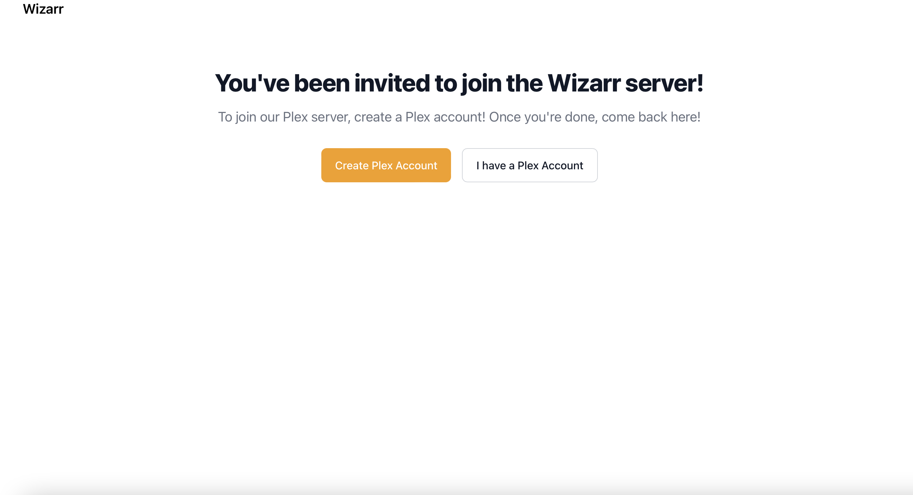
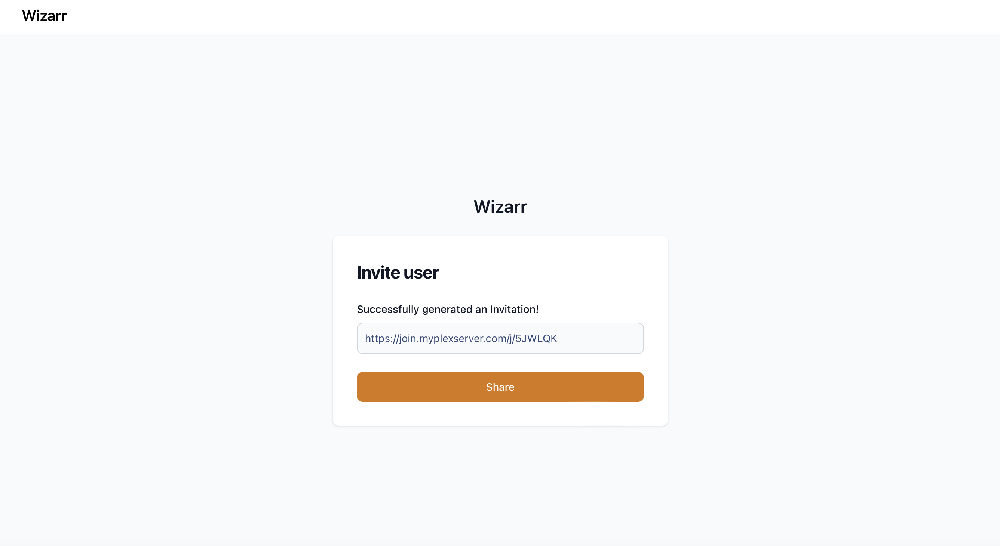
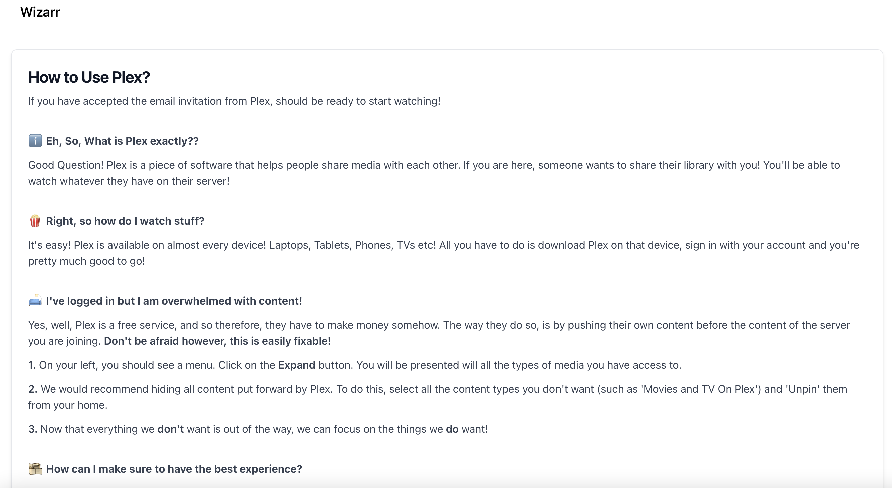
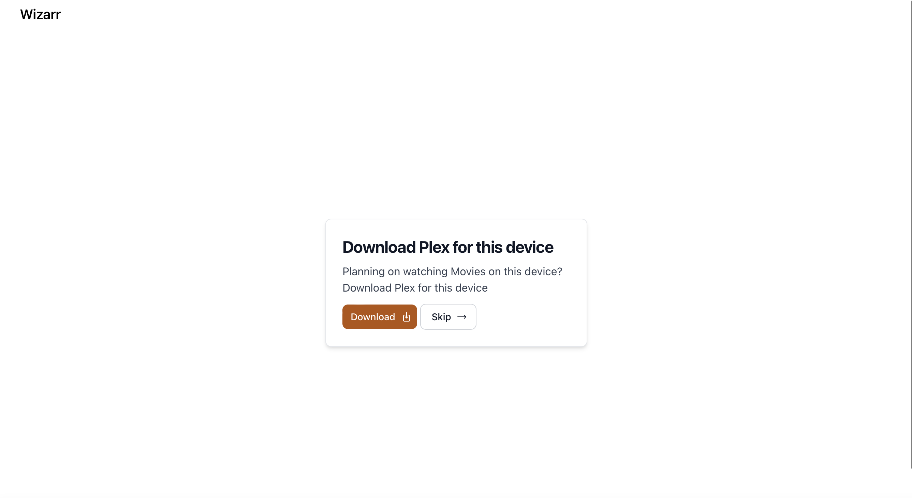
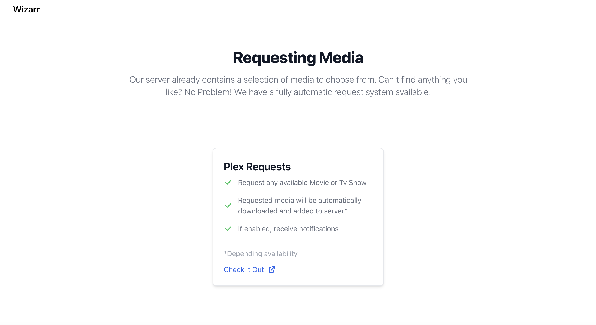
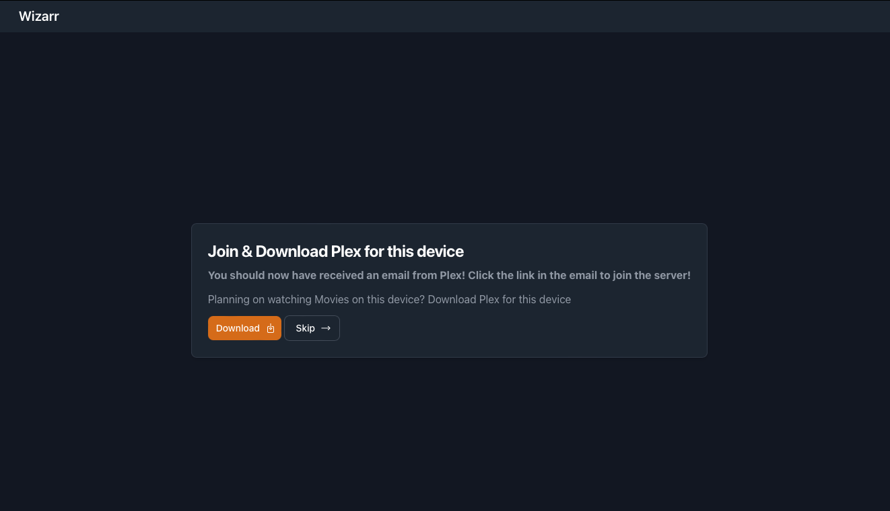
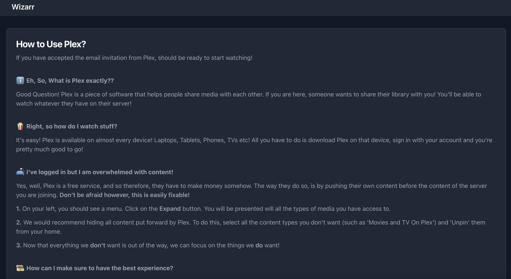
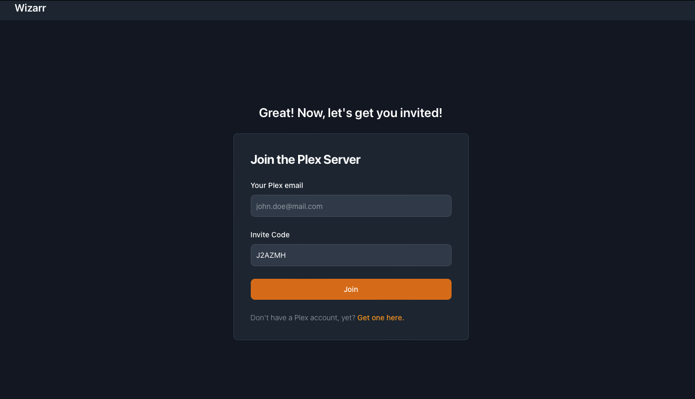
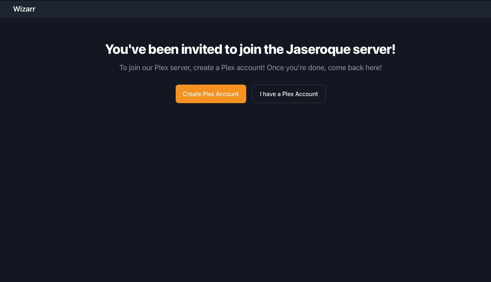

# Wizarr 


**Attention! Wizarr is still under development, you may experience issues.**

Wizarr is a automatic user invitation system for Plex. Create a unique link and share it to a user and they will automatically be invited to your Plex Server! They will even be guided to download the Plex client and instructions on how to use Overseerr!





## Major Features Include

- Automatic Invitation to your Plex Server
- Secured invitation environment
- Plug and Play SSO Support*
- Guide user on how to download Plex client
- (Optional!) Overseer Integration: Guide users on how to request Movies

## Planned features

- Discord Bot Integration 
- jellyfin support
- Multilingual Support


## A note on SSO (Authelia, Authentik, etc)

As mentionned in the features, Wizarr supports SSO via disabling its inbuilt authentication!
Attention! While setting up Wizarr, you will still be asked for a username and password, but these will be ignored if you enabled `DISABLE_BUILTIN_AUTH`
To Setup, protect the Wizarr App with your SSO provider using Authelia for example or in the case of Authentik, using a Proxy Provider.
However, make sure to whitelist the following paths, or users will not be able to join!
- /join
- /j*
- /setup*

## Installation

### Docker Compose (recommended)

1. Download Docker-compose file

```
version: "3.8"
services:
  wizarr:
    container_name: wizarr
    image: ghcr.io/wizarrrr/wizarr
    #image: ghcr.io/wizarrrr/wizarr:arm64 #For Arm64
    ports:
    - 5690:5690
    volumes:
      - ./data:/data/database
    environment:
      - "APP_URL=https://join.domain.com"
      #- "DISABLE_BUILTIN_AUTH=false" Set to true ONLY if you are using another auth provider (Authelia, Authentik, etc)
  
  watchtower: #Optional but recommended, as Wizarr is still in development and will be updated frequently
    image: containrrr/watchtower
    volumes:
      - /var/run/docker.sock:/var/run/docker.sock
    command: wizarr --interval 30
```

2.  **Important** Edit Variables

    APP_URL: Public Facing Url of your Wizarr instance
    DISABLE_BUILTIN_AUTH: Set to true if you want to disable the built in authentication and use SSO instead

3.  Run `docker compose up -d` or for older Docekr versions: `docker-compose up -d`
4.  Access WebUI at http://localhost:5690 and setup your Plex Server

## Screenshots

*These may be out of date*

#### Light Mode






#### Dark Mode




