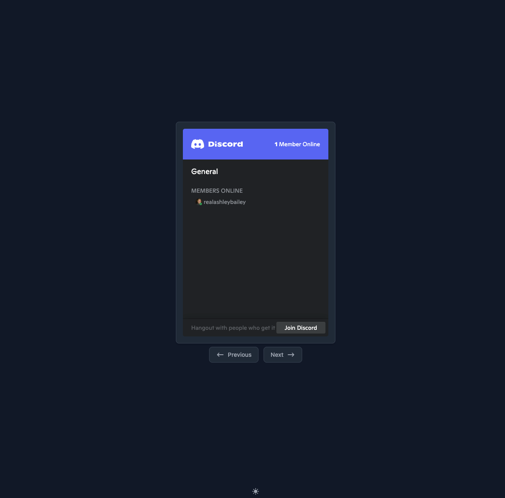

# Discord Integration

#### Find your Discord Server ID

1. In Discord, go to your **Server Settings**
2. Select the **Widget** tab
3. Enable Server Widget
4. Choose an Invite Channel (`general` for example)
5. Copy your **Server ID**

#### Toggle the Discord Widget

Wizarr supports using either the standard Discord widget, or a custom widget utilizing the Discord API. The custom widget is enabled by default, and provides a more integrated look and feel, however if this is not desired you can toggle the standard widget on in Wizarr's settings.


If your Discord information is not showing, this maybe because Discord has flagged your IP for too many requests. Please try again later.




<figure><figcaption>
Custom Discord Widget
</figcaption></figure>



<figure><figcaption>
Standard Discord Widget
</figcaption></figure>




**Why not use an invitation link?**

Enabling the widget and the invite channel makes the Discord API dynamically generate an invitation link for the purpose of the widget.

This means that to use this integration, you don't need to generate a Never expiring invitation, which some users might want to avoid.

